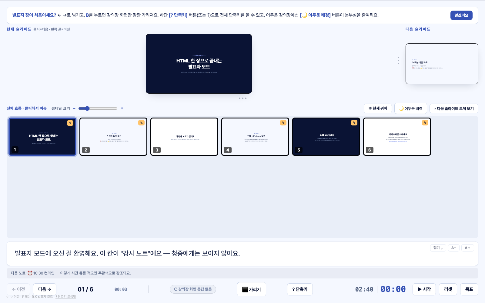

# 발표자 모드 (Presenter Mode)

   

> HTML 슬라이드에 파워포인트급 **"발표자 보기"** 를 더해요.
> **파일 하나 · 설치 없음 · 인터넷 없음.**



- 🖥️ **발표자 창(나만 봄)** — 현재/다음 슬라이드 · 강사 노트 · 타이머 · 필름스트립
- 📽️ **강의장 화면(청중)** — 슬라이드만 깨끗하게, 전체화면
- 🔌 강의장 와이파이가 죽어도 그대로 작동 — 실제 기업·기관 강의(7시간 풀데이 포함)에서 쓰는 도구예요

## 왜 만들었나

저는 AI 강의를 다니는 강사예요. 강의 교안은 클로드코드 에이전트로 **HTML 슬라이드**로 만들어요 — PPT보다 훨씬 빠르고, 디자인도 예쁘게 나와요.

그런데 딱 하나가 없었어요. **발표자 보기.**

파워포인트라면 당연히 있는 그 화면 — 노트 보면서, 다음 슬라이드 확인하면서, 시간 체크하면서 진행하는 화면이요. HTML 슬라이드는 그게 없어서 노트를 종이로 뽑아 들고 7시간 강의를 뛰었어요. 그래서 직접 만들었고, 이제 HTML 슬라이드를 쓰는 모든 분들과 나눠요.

| 목차 | [① 3분 체험](#-1-일단-3분-체험) → [② 내 슬라이드에 붙이기](#-2-내-슬라이드에-붙이기--방법은-2가지) → [③ 기능](#-3-기능-한눈에) → [④ 단축키](#-4-단축키) → [⑤ 강의장 세팅](#-5-강의장-세팅-체크리스트) → [⑥ 작동 원리](#-6-어떻게-동작하나요) → [FAQ](#faq) |
|---|---|

---

## ▶ 1. 일단 3분 체험

1. 초록색 `Code` 버튼 → `Download ZIP` → 압축 풀기
2. `index.html` **더블클릭** (크롬으로 열려요)
3. 키보드 **`P`** — 발표자 창 등장!

> [!TIP]
> 데모 슬라이드 7장이 곧 튜토리얼이에요. 방향키로 넘기며 노트 강조 → `B` 쉬는 시간 화면 → `D` 판서 → `M` 돋보기 → `Z` 구역 확대 → `4` `Enter` 점프를 순서대로 눌러보세요.

---

## ▶ 2. 내 슬라이드에 붙이기 — 방법은 2가지

|  | **방법 1 · AI에게 시키기** ⭐ | **방법 2 · 직접 붙이기** |
|---|---|---|
| 누구에게 | 비개발자, 바쁜 분 | HTML이 편한 분 |
| 걸리는 시간 | 약 5분 | 10~20분 |
| 필요한 것 | 클로드코드 등 AI 코딩 도구 | 텍스트 에디터 |

### 방법 1 · AI에게 시키기 ⭐

아래 프롬프트를 클로드코드에 그대로 붙여넣으세요. **바꿀 곳은 대괄호 `[ ]` 두 곳뿐**이에요.

```text
아래 저장소의 "발표자 모드"를 내 슬라이드 파일에 붙여줘.

저장소: https://github.com/jinnyjiinlee/presenter-mode
내 슬라이드 파일: [내 슬라이드 HTML 파일 경로. 예: ~/Desktop/발표자료.html]

작업 순서:
1. 저장소의 index.html에서 발표자 모드 엔진을 통째로 가져와
   (CSS의 "발표자 모드 (Presenter View)" 섹션부터 끝까지 + <script> 블록 전체)
2. 내 슬라이드 파일 구조를 먼저 읽고, 슬라이드 한 장이 <section class="slide">
   하나가 되도록 맞춰줘 (첫 장만 class="slide active").
   내 슬라이드가 1600×900 기준이 아니면 .deck-inner/.slide 크기와
   fit() 함수의 계산을 내 슬라이드 크기에 맞게 바꿔줘.
3. NOTES 배열을 내 슬라이드 장수만큼 만들어줘. 내용은 일단 전부 빈 문자열로
   두되, 각 줄에 /*번호 슬라이드제목*/ 주석을 달아서 내가 나중에 채우기 쉽게 해줘.
4. DECK_ID를 '[내 덱 이름. 예: sales-2026]'으로 바꿔줘.
5. 다 되면 크롬으로 열어서 확인해줘: P 키로 발표자 창이 뜨는지,
   방향키로 넘길 때 두 창이 같이 움직이는지, B 키 블랙아웃이 되는지.

주의: 내 원본 슬라이드의 디자인과 내용은 절대 바꾸지 마.
```

끝나면 크롬에서 열고 `P` — 그게 전부예요. 노트도 AI에게 시키면 돼요:

```text
3번 슬라이드 노트에 "여기서 질문 받기"라고 넣어줘.
```

<details>
<summary><b>방법 2 · 직접 붙이기</b> — 세 군데만 바꾸면 돼요 (클릭해서 펼치기)</summary>

<br>

`index.html`이 곧 템플릿이에요.

**① 슬라이드 교체** — 파일 안 `▼▼▼ 여기부터 교체` 주석 사이의 `<section class="slide">` 들을 여러분 슬라이드로 바꿔요.

```html
<section class="slide">   <!-- 슬라이드 1장 = section.slide 하나 -->
  <!-- 1600×900 기준으로 디자인하면 자동으로 화면에 맞게 스케일돼요 -->
</section>
```

- 첫 슬라이드에만 `class="slide active"` — 내부 디자인은 완전 자유

**② 노트 채우기** — `<script>` 안 `NOTES` 배열에 슬라이드 순서대로 멘트를 적어요.

```js
const NOTES = [
/*01*/ `오프닝 멘트. ⏰ 10:30 컷라인 — 시간 큐는 주황으로 강조돼요.`,
/*02*/ ``,   // 노트 없는 장은 빈 문자열
/*03*/ `⚠️ 이 시연은 와이파이 필요. 백업: backup.png`,
];
```

**③ 덱 이름 정하기** — `DECK_ID`를 덱마다 다르게. (같은 브라우저에서 여러 덱을 써도 슬라이드 위치·타이머가 안 섞이는 열쇠예요)

```js
const DECK_ID='my-lecture-2026';
```

</details>

---

## ▶ 3. 기능 한눈에

| 🖥️ 발표자 창 | 📽️ 강의장 화면 | 🎯 진행 |
|---|---|---|
| 현재/다음 슬라이드 (비율 드래그 조절) | `B`/`W` 블랙아웃 — 슬라이드 넘기면 자동 해제 | 리모컨(클리커) 호환 |
| 강사 노트 — `⏰`주황 `⚠️`빨강 `백업`파랑 자동 강조 + 다음 노트 미리보기 | ✏️ 판서 — 펜·형광펜·지우개, 두 창 실시간 동기화 | 숫자+`Enter` 점프 |
| 필름스트립 — 클릭 이동 · 노트 있는 장 ✎ 배지 | ☕ 쉬는 시간 화면 — 기본은 검정, [☕ 쉬는화면] 버튼으로 로고·안내문·QR·시계·BGM 꾸미기 | 두 창 자동 동기화 (2초 내 자동 복구) |
| 타이머 — 목표 설정 → 남은 시간·5분 전 알림, 창 닫아도 유지 | 🔍 돋보기 · `Z` 구역 확대 — 원하는 부분만 크게 | 마지막 장에서 안 튐 |
| 현재 시각 · 체류 시간 · 연결 상태 ●/○ · 🌙 다크 토글 | 4초 뒤 커서·힌트 숨김 · Wake Lock · 도움말 청중 노출 차단 | `Home`/`End` · `F5` |

### ☕ 쉬는 시간 화면 커스터마이즈 (v5)

`B`의 기본 동작은 순수 검은 화면이에요. 꾸미고 싶은 사람만 설정하면 웨비나 대기·브레이크 타임용 안내 화면으로 바뀌어요. 방법은 2가지:

- **방법 1 · 버튼으로 (코드 수정 없음)** — 발표자 창 하단 **[☕ 쉬는화면]** 버튼 → 프리셋(☕ 쉬는 시간 · 🍽 점심시간 · 💻 실습 · 🙋 Q&A · 🕘 곧 시작)을 클릭 한 번으로 적용하거나, 제목·문구·로고/QR 이미지·시계·BGM을 폼에서 직접 설정. 브라우저에 덱별로 저장돼요.
- **방법 2 · 코드 기본값** — `<script>` 안 `BREAK_SCREEN`을 채우면 그게 이 덱의 기본값이 돼요 (버튼 설정이 있으면 그쪽이 우선).

```js
const BREAK_SCREEN={
  title:'☕ 잠깐 쉬어가요',          // 큰 제목 — 전부 비우면(기본) 순수 검은 화면
  sub:'10분 뒤에 다시 시작할게요',    // 부제목
  logoText:'OO컴퍼니',               // 텍스트 로고 (이미지는 logoImg에 경로)
  logoImg:'',                       // 예: 'logo.png'
  qrImg:'',                         // 예: 'qr.png' — 커뮤니티·웹사이트 QR
  qrLabel:'',                       // QR 아래 설명
  showClock:true,                   // 현재 시각 표시
  bgm:''                            // 예: 'break.mp3' — 쉬는 시간 BGM (♪ 버튼으로 재생/정지)
};
```

> [!NOTE]
> BGM은 브라우저 자동재생 정책 때문에 첫 재생 시 화면의 ♪ 버튼을 한 번 눌러야 할 수 있어요.

---

## ▶ 4. 단축키

> [!TIP]
> 외울 필요 없어요 — 발표자 창 하단 **[? 단축키]** 버튼(또는 `?`)을 누르면 화면에 다 떠요.

| 키 | 동작 |
|---|---|
| `←` `→` · `Space` · `Enter` · 리모컨 | 슬라이드 이동 |
| 숫자 + `Enter` | 해당 번호로 점프 |
| `Home` / `End` | 처음 / 마지막 |
| `B` / `W` | 강의장 화면 가리기 — `B`는 쉬는 시간 화면(커스터마이즈 가능) / `W`는 흰 화면 |
| `D` / `G` / `E` | 펜 / 형광펜 / 지우개 — 두 창 실시간 동기화 · `Esc` 종료 |
| `M` | 마우스 돋보기 (강의장 화면) · 휠로 배율 조절 |
| `Z` | 구역 확대 — 드래그한 영역을 화면에 꽉 채움 (클릭=2배 · 다시 `Z`면 원위치) |
| `F` 또는 `F5` | 전체화면 |
| `P` · `⌘K`(맥) · `Ctrl+K`(윈도우) | 발표자 창 열기 |
| `V` | 발표자 창 보기 전환 |
| `T` / `R` | 타이머 시작·정지 / 리셋(두 번) |
| `?` 또는 `H` | 단축키 도움말 |

---

## ▶ 5. 강의장 세팅 체크리스트

> [!IMPORTANT]
> 디스플레이는 꼭 **"확장"** 모드로! 미러링(복제) 상태면 발표자 노트가 청중에게 그대로 보여요.

1. 빔프로젝터 연결 → **"확장"** 모드 (맥: `⌘+Fn+F1` 토글 · 윈도우: `Win+P`)
2. 내 덱 HTML 열고 `P` → 발표자 창 등장
3. 슬라이드 창(=강의장 화면)을 프로젝터로 드래그 → `F` 전체화면
4. 발표자 창 하단 **"● 강의장 화면 연결됨"** 초록불 확인 — 끝!

라이브 시연 땐 `⌘+Fn+F1`로 잠깐 미러링 → 끝나면 다시 확장. 슬라이드 위치는 안 흐트러져요.

---

## ▶ 6. 어떻게 동작하나요

```
[내 노트북]   발표자 창 (#presenter) — 노트 · 타이머 · 다음 슬라이드
     ▲
     │  localStorage + BroadcastChannel 실시간 동기화
     │  (전부 브라우저 안 — 인터넷 불필요)
     ▼
[빔프로젝터]  강의장 화면 — 슬라이드만 전체화면
```

- 같은 HTML 파일을 **창 2개**로 열어요. URL 해시가 `#presenter`면 발표자 UI, 아니면 슬라이드를 렌더링해요.
- 발표자 창이 2초마다 ping, 강의장 화면이 pong — 연결 상태 표시(●/○)와 어긋남 자동 복구의 원리예요.
- 미리보기·썸네일은 슬라이드 DOM을 `cloneNode` + `scale()`로 축소한 것 — 이미지 캡처가 아니라 항상 원본과 똑같아요.
- 타이머·테마·레이아웃은 `localStorage`에 저장 — 창을 닫아도 유지돼요.

**요구 사항** — 크롬/엣지 권장 · 맥·윈도우 지원 · 서버·빌드·설치 불필요 (`file://`로 그냥 열면 돼요)

---

## FAQ

<details><summary><b>발표자 창을 실수로 닫았어요.</b></summary><br>

`P`로 다시 열면 현재 슬라이드·타이머까지 그대로 따라와요.
</details>

<details><summary><b>팝업이 차단됐대요.</b></summary><br>

주소창 오른쪽 팝업 아이콘에서 "항상 허용" 후, 화면 안내의 [허용했어요 — 다시 열기] 버튼을 누르면 돼요.
</details>

<details><summary><b>PDF로도 뽑고 싶어요.</b></summary><br>

크롬 인쇄(`⌘P`)에서 PDF 저장 — 발표자 UI는 인쇄에서 자동 제외돼요.
</details>

<details><summary><b>두 대의 컴퓨터에서 쓸 수 있나요?</b></summary><br>

아니요 — 한 컴퓨터의 화면 2개(노트북+프로젝터) 구조예요. 동기화가 브라우저 안에서만 일어나기 때문이에요.
</details>

<details><summary><b>파워포인트/키노트 파일에도 붙일 수 있나요?</b></summary><br>

아니요, HTML 슬라이드 전용이에요. 요즘은 AI에게 "이 PPT 내용을 HTML 슬라이드로 만들어줘"라고 한 뒤 붙이는 방법도 있어요.
</details>

---

## 피드백

쓰다가 불편한 점, 아이디어가 있다면 —

- 이 저장소에 **[Issue](../../issues)** 를 남겨주세요
- 또는 **ceo@dayfocuslab.com** 으로 `[발표자 모드 피드백]` 제목으로 보내주세요

## 라이선스

MIT — 자유롭게 쓰고 고치고 나눠주세요. © [DAYFOCUS LAB](https://www.dayfocuslab.com)
